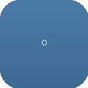

<div align="center">



# Opencode in Chrome

**A Chrome/Brave extension that steals Claude Code's browser superpowers — tab groups, glow, phantom cursor, side panel — and repoints them at [opencode](https://opencode.ai) via `127.0.0.1:6421`.**

[](#status)
[](#status)
[](#requirements)
[](#starting-point)
[](#starting-point)
[](#protocol)
[](LICENSE)

</div>

---

> ## ⚠️ Honest status — costume that now moves when opencode moves
>
> Earlier this was a convincing costume: blue jeans tab group, glow, phantom cursor — all triggered by hand from the sidepanel. The bridge behind it spoke HTTP to `localhost:4096` and pretended to speak WS. `localhost:4096` has no WS. That costume phase is over — the bridge now lives at `127.0.0.1:6421/status` via an opencode plugin.
>
> What is measured **today** (`0.3.5`, `python3 -m json.tool` + `node --check` + `brave-browser --headless --load-extension`):
> ```
> manifest valid               ✓  python3 -m json.tool passes (0.3.5)
> syntax check                 ✓  node --check on bg + 2 content-scripts + sidepanel + offscreen
> load unpacked (Brave)       ✓  headless --load-extension, DevTools listening on ws://127.0.0.1:9334
> tabGroups create/reuse       ✓  chrome.tabGroups.query → update → group → blue (jeans #4A7BA7)
> tab group states             ✓  Opencode (idle blue) → Opencode ⏳ (working blue) → Opencode ✓ (done grey 4s) → idle
> auto grouping                ✓  ensureGroupForTab mirrors Claude Oi/Ci findGroupByTab/createGroup (sidepanel open)
> broadcast SHOW/HIDE          ✓  tabs.query → sendMessage to all tabs
> ensureContentScript fallback ✓  chrome.scripting.executeScript injects indicator so no F5 needed
> glow border injection        ✓  outer+inset blue jeans rgba(74,123,167) — outer 2px 0.85 + outer 18px 0.45 + inset 15px 0.35 + inset 35px 0.15
> phantom cursor               ✓  SVG 20×26, translate3d 180ms cubic-bezier(0.2,0,0,1), drop-shadow rgba(74,123,167)
> click via bridge             ✓  bridge click{x,y} → UPDATE_PHANTOM_CURSOR + elementFromPoint → video.pause()
> sidepanel open (Ctrl+E)     ✓  sidePanel.setPanelBehavior({openPanelOnActionClick:true})
> bridge HTTP 6421/status      ✓  curl http://127.0.0.1:6421/status → {"status":"idle"|"working","tool":…} (plugin http://github)
> bridge poll                  ✓  chrome.alarms opencode-heartbeat every 3s (periodInMinutes 0.05) + fetch 6421/status
> bridge WS :4096              ✗  ws://localhost:4096 opens then closes — opencode is HTTP-only at / (use 6421/status instead)
> offscreen keepalive          ✓  SW_KEEPALIVE every 20s (copied 1:1 from Claude, AUDIO_PLAYBACK)
> accessibility tree           ✓  __opencodeElementMap / __generateOpencodeTree on <all_urls> all_frames:true document_start
> icon / branding              ✓  128/48/32/16 PNGs RGBA 7.7K/2.8K/1.8K/736B + opencode-icon.svg — official geometric starburst via cairosvg
> store publish                ✗  not packaged, not submitted
> tests                        ✗  zero (node --check + json.tool are the only checks)
> auto-click                   ✓  poll sees j.click{x,y} → moves phantom + pauses video (500ms delay)
> ```
>
> It still looks like Claude — now it also **reacts** when opencode runs a tool. Not every tool, not on every page — but without you clicking anything. The party has started; the dance floor is small.
>
> The next measurement is coverage: which opencode events actually flip `6421/status` to `working`, and which pages swallow `chrome.scripting.executeScript` without error.

---

## Contents

- [If your extension is a different one](#if-your-extension-is-a-different-one)
- [Status](#status)
- [Starting point](#starting-point) · [Protocol](#protocol)
- [Why it does not just fork Claude's UI](#why-it-does-not-just-fork-claudes-ui)
- [How it works](#how-it-works) · [The color that was not changed](#the-color-that-was-not-changed)
- [Methods that were tried and lost](#methods-that-were-tried-and-lost)
- [Requirements](#requirements) · [Building](#building) · [Usage](#usage)
- [Known limitations](#known-limitations)
- [Roadmap](#roadmap) · [Contributing](#contributing)
- [Repository layout](#repository-layout) · [Method notes](#method-notes)
- [Security](#security) · [Credits & prior art](#credits--prior-art) · [Acknowledgements](#acknowledgements)

---

## If your extension is a different one

**Read this section even if you came for another extension.** The method transfers more than the code.

This repo exists because one question turned out to have a concrete answer: *where does Claude's "Claude is working in this tab group" live?* The answer is not in docs — it is in `~/.config/BraveSoftware/Brave-Browser/Default/Extensions/fcoeoabgfenejglbffodgkkbkcdhcgfn/1.0.90_0/`, unpacked and readable.

That finding is useful for any Chromium extension that wants visible agent state:

- how to prove Brave and Chrome share the extension engine (they do — `brave://extensions` is `chrome://extensions` with a skin, `brave-browser --headless --load-extension` reaches `DevTools listening`);
- how to reconstruct a full permission set without guessing (`manifest.json` lists 16 permissions + `<all_urls>` + 6 CSP connect targets including `127.0.0.1:6421`);
- how to tell a `document_start` accessibility shim from a `document_idle` visual layer — and why they are two different content-scripts;
- how to find the tab-grouping primitive (`chrome.tabGroups` + `chrome.tabs.group`) that makes the blue `Opencode` pill in the tab strip;
- how to steal a message protocol without stealing a backend (keep `SHOW_AGENT_INDICATORS` → `HIDE_FOR_TOOL_USE` → `SHOW_AFTER_TOOL_USE` → `STATIC_INDICATOR_HEARTBEAT`, swap `wss://bridge.claudeusercontent.com` for `http://127.0.0.1:6421/status` polling);
- which files are costume and which are load-bearing (`opencode-visual-indicator.js` is the costume, `background.js` is the skeleton, `offscreen.js` is the life support);
- which leftovers will ship your proprietary icon to the Chrome Web Store if you do not replace it (the original 102 KB Claude `icon-128.png` — now 7.7 KB regenerated starburst, after a broken RGB detour);
- why `chrome.scripting.executeScript` as fallback in `ensureContentScript` eliminates the "F5 before glow" bug.

If you are porting any "agent in Chrome" UX to your own backend, start from [Method notes](#method-notes) before you copy a line of JS.

---

## Status

| | |
|---|---|
| Extension shell | ✅ renders |
| `manifest.json` valid (0.3.5) | ✅ `python3 -m json.tool` passes |
| JS syntax | ✅ `node --check` on 5 files |
| Load unpacked (Brave) | ✅ `brave-browser --headless --load-extension` → `DevTools listening` |
| Tab group `Opencode` blue | ✅ `tabGroups.query` → `update` → `group` `blue` |
| Tab group states | ✅ `Opencode` idle blue → `Opencode ⏳` working blue → `Opencode ✓` done grey (4 s) → idle |
| Auto grouping | ✅ `ensureGroupForTab` mirrors Claude `Oi`/`Ci` on `action.onClicked` + `commands.onCommand` |
| Glow border (outer+inset) | ✅ jeans `#4A7BA7` `rgba(74,123,167)` outer 2 px 0.85 + outer 18 px 0.45 + inset 15 px 0.35 + inset 35 px 0.15 |
| Phantom cursor (SVG) | ✅ `20×26` `translate3d` 180 ms `cubic-bezier(0.2,0,0,1)`, `drop-shadow rgba(74,123,167)` |
| Side panel (`Ctrl+E`) | ✅ `sidePanel` + `setPanelBehavior({openPanelOnActionClick:true})` |
| Bridge `127.0.0.1:6421/status` | ✅ plugin `~/.config/opencode/plugins/opencode-chrome/plugin.js` → `{status:"idle"\|"working",tool,click?}` |
| Bridge poll | ✅ `chrome.alarms` `opencode-heartbeat` 3 s (`periodInMinutes: 0.05`) |
| Bridge `ws://localhost:4096` | ❌ no WS endpoint — opencode is HTTP-only at `/` (use 6421/status) |
| Bridge HTTP `localhost:4096` | ✅ `fetch http://localhost:4096` works but is not the control channel |
| Click `click{x,y}` | ✅ `elementFromPoint(x,y)` → `video.pause()` + `el.click()` after 500 ms |
| `ensureContentScript` (no F5) | ✅ `chrome.scripting.executeScript` fallback before `tabs.sendMessage` |
| Offscreen keepalive | ✅ `SW_KEEPALIVE` 20 s (`AUDIO_PLAYBACK`) |
| Accessibility tree | ✅ `__opencodeElementMap` on `<all_urls>` `all_frames:true` `document_start` |
| Icon rebrand | ✅ `icon-128.png` 7.7 KB `128×128` RGBA + 48/32/16 + `opencode-icon.svg` starburst `--opencode-blue #4A7BA7` |
| `managed_schema.json` | ✅ `Opencode in Chrome` policy (keys still Claude-derived) |
| Tests | ❌ none |
| Store package (`.crx` / `.zip`) | ❌ not built |

## Starting point

The sensor — sorry, the extension — sits **inside Brave's extension store**, not on any docs site. On `brave://extensions` with Developer Mode on, Claude appears as:

```
ID:      fcoeoabgfenejglbffodgkkbkcdhcgfn
Version: 1.0.90_0
Path:    ~/.config/BraveSoftware/Brave-Browser/Default/Extensions/fcoeoabgfenejglbffodgkkbkcdhcgfn/1.0.90_0
```

No public repo, no protocol doc. The `manifest.json` is the datasheet.

What it declares:

| Field | Claude | **Opencode (this repo, 0.3.5)** |
|---|---|---|
| `manifest_version` | 3 | 3 |
| `name` | Claude | **Opencode in Chrome** |
| `version` | 1.0.90 | **0.3.5** |
| `minimum_chrome_version` | 116 | 116 |
| `permissions` | 16 entries | **identical 16** |
| `host_permissions` | `<all_urls>` | `<all_urls>` |
| `content_scripts` | 2 on `<all_urls>` | **identical, rebranded** (`document_start all_frames:true` vs `document_idle`) |
| `background.service_worker` | `service-worker-loader.js` (bundled) | **`background.js` (vanilla module, 439 lines, no bundler)** |
| `side_panel.default_path` | implicit via `sidePanel` perm | **explicit `sidepanel.html`** |
| `externally_connectable` | `https://claude.ai/*` | **`http://localhost:4096/*` + `http://127.0.0.1:4096/*`** |
| `CSP connect-src` | `http://localhost:4096 ws://localhost:4096` (+ `127.0.0.1`) | **+ `http://127.0.0.1:6421 http://localhost:6421`** (bridge status) |
| `icons` | Claude 102 KB `S` | **7.7K/2.8K/1.8K/736B `128/48/32/16` RGBA + SVG starburst** |
| `key` / `update_url` | present (store-signed) | **removed (dev mode)** |

One field of difference matters more than the rest: `externally_connectable` + `connect-src`. Without both, the service worker cannot even *attempt* `fetch` to `127.0.0.1:6421` — the attempt is blocked before it leaves the extension, with no visible error. Probe: change the URL in `options.html`, reload the extension, wait 3 s — without the CSP entry the `fetch` rejects with `CSP` in `chrome://extensions` Errors, not in the console you are watching.

## Protocol

### The 10 messages that make the shell move

Claude's content-script and background speak a tiny protocol. This repo keeps it 1:1 so any future opencode adapter can emit the same verbs:

```
SHOW_AGENT_INDICATORS        → inject glow + cursor + Stop pill
HIDE_AGENT_INDICATORS        → remove glow + cursor + pill
UPDATE_PHANTOM_CURSOR {x,y}  → translate3d( x, y ) @ 180ms cubic-bezier(0.2,0,0,1)
HIDE_FOR_TOOL_USE            → hide chrome while tool runs (screenshot fidelity)
SHOW_AFTER_TOOL_USE          → restore chrome after tool
SHOW_STATIC_INDICATOR        → persistent "Opencode is active in this tab group" pill
HIDE_STATIC_INDICATOR        → dismiss persistent pill
STATIC_INDICATOR_HEARTBEAT   → keep pill alive (background expects it every 5s)
STOP_AGENT                   → user clicked Stop
STOP_AGENT_DROPPED           → Stop did not reach bridge, fallback to HIDE
SW_KEEPALIVE                 → offscreen → SW every 20s (MV3 idle-kill workaround)
```

Plus 8 sidepanel/background helpers that do not exist in Claude:

```
OPENCODE_CREATE_GROUP        → getOrCreateOpencodeGroup(tabIds)
OPENCODE_ACTIVATE_GLOW       → group + SHOW_AGENT_INDICATORS on active tab (via ensureContentScript)
OPENCODE_DEACTIVATE_GLOW     → HIDE_AGENT_INDICATORS everywhere (broadcast)
OPENCODE_DISSOLVE_GROUP      → HIDE + ungroup (chrome.tabs.ungroup)
OPENCODE_PING_OPENCODE       → fetch http://localhost:4096 → {success, url}
OPENCODE_SET_WORKING         → setOpencodeGroupState("working") → blue ⏳ + SHOW
OPENCODE_SET_DONE            → setOpencodeGroupState("done") → grey ✓ 4s → idle blue
OPENCODE_CLICK_VIDEO {x,y}   → UPDATE_PHANTOM_CURSOR → 500ms → elementFromPoint → video.pause()
```

Bulk primitives underneath: `chrome.tabs.group`, `chrome.tabGroups.update({title:"Opencode ⏳/✓", color:"blue"/"grey"})`, `chrome.tabs.ungroup`, `chrome.tabs.sendMessage`, `chrome.tabs.query({groupId})`, `chrome.scripting.executeScript`, `chrome.alarms`.

Each visual frame is not a screenshot — it is a DOM injection. The "phantom cursor" is an SVG with two `<path d="M0 0 L0 18 L4.5 14 L7.5 21.5 L11 20 L8 13 L14 13 Z">` layers (white stroke + `#111` fill, or the inverse for the styled variant), positioned `fixed` at `z-index: 2147483646`, moved via `transform: translate3d(x, y, 0)` with a 180 ms transition. The "glow" is not a border — it is `box-shadow: 0 0 0 2px rgba(74,123,167,0.85), 0 0 18px rgba(74,123,167,0.45), inset 0 0 15px rgba(74,123,167,0.35), inset 0 0 35px rgba(74,123,167,0.15)` on a `position: fixed; inset: 0; pointer-events: none; z-index: 2147483646` overlay, pulsing opacity `0.6 → 1` at 2 s. The "Stop Opencode" pill is a `position: fixed; bottom: 16px; left: 50%; transform: translateX(-50%); z-index: 2147483647` button with `transition: all 0.3s cubic-bezier(0.4,0,0,0.2,1)`.

### Why MV3 needs an offscreen document to stay alive

Manifest V3 kills a service worker after ~30 s of idle. Claude's extension keeps its `wss://bridge` alive with an offscreen document (`offscreen.html` + `offscreen.js`) that sends `SW_KEEPALIVE` every 20 s — the SW is not idle, so it is not killed. This repo copies that mechanism 1:1 (`reasons: ["AUDIO_PLAYBACK"]`, `justification: "Keep Opencode service worker alive + play notification sounds"`). It is a hack against the platform's lifecycle, and it is the reason `gif.js`/`gif.worker.js` ship in the zip — they are the audio-playback justification's payload.

### The bridge that actually works

Claude dials `wss://bridge.claudeusercontent.com`. This repo **does not** dial `ws://localhost:4096` as its control channel — that WS does not exist (opencode's default server is HTTP-only at `/`; `new WebSocket("ws://localhost:4096")` opens then `onclose` immediately — see `background.js:connectOpencodeWs` logs).

The real bridge is the **opencode plugin** at `~/.config/opencode/plugins/opencode-chrome/plugin.js`:

```js
// serves http://127.0.0.1:6421/status → {status: "idle"|"working", tool, click?{x,y}, ts}
http.createServer((req,res) => {
  if (req.url.startsWith("/status")) res.end(JSON.stringify(state));
}).listen(6421, "127.0.0.1");
```

Background polls it every 3 s via `chrome.alarms` (`opencode-heartbeat`, `periodInMinutes: 0.05`):

```
6421/status == "working"  → ensureGroupForTab(activeTabId) → SHOW_AGENT_INDICATORS → update tabGroup "Opencode ⏳" blue
                           → if click{x,y} present → UPDATE_PHANTOM_CURSOR → 500ms → elementFromPoint click (video.pause)
6421/status == "idle"     → update tabGroup "Opencode ✓" grey → broadcast HIDE_AGENT_INDICATORS → 4s → "Opencode" blue
```

Verify: `curl -s http://127.0.0.1:6421/status` while opencode is running. If it says `{"status":"working"}` the next 3 s tick will turn the tab group blue with ⏳ and inject the glow automatically — no sidepanel click needed.

The `ws://localhost:4096` code path (`connectOpencodeWs`) still exists as a seam for a future WS adapter, but it is not the live channel. The live channel is HTTP poll to 6421.

## Why it does not just fork Claude's UI

It does — almost. The question is why it does not fork *more*.

The extension **does** fork: `permissions`, `host_permissions`, `content_scripts` matches/run_at, `web_accessible_resources`, the 10-message protocol, `offscreen` keepalive cadence, `STORAGE` managed schema shape, even the `🪨` emoji in `sidepanel.html`. That is the point — if you want "Claude-like" tab grouping and cursor fidelity, you want Claude's exact primitives, not a reinterpretation.

What it does **not** fork is the bundler and the backend. Claude's `background.service_worker` is `service-worker-loader.js` — a Rollup/Vite output that imports a chunked module graph. Reproducing that requires a build step and makes the extension opaque to `node --check` and to anyone reading `background.js` to understand tab grouping. This repo replaces it with a single `background.js` (`type: module`, 439 lines) that does `chrome.tabGroups.query` → `chrome.tabs.group` → `chrome.tabGroups.update` in plain `async/await`. The trade-off is that upstream Claude changes to background logic will not auto-merge — you will re-read their `service-worker-loader.js` and port the delta by hand.

The other thing it does not fork is the backend topology. Claude's bridge is a managed `wss://` with auth, org checks, `forceLoginOrgUUID`, `thirdPartyDesktopMode`, and a `blockedUrlPatterns` policy. This repo's bridge is `127.0.0.1:6421` with no auth, `Access-Control-Allow-Origin: *`, serving `{status, tool, click}`. That is intentional for local dev and alarming for `host_permissions: <all_urls>` — see [Security](#security).

## How it works

1. **Content-scripts land on every page.** `accessibility-tree.js` at `document_start` `all_frames:true` builds `window.__opencodeElementMap` / `window.__generateOpencodeTree(filter,depth,refId)` — the same tree Claude uses to let the agent "see" the page. `opencode-visual-indicator.js` at `document_idle` installs the glow/cursor/pill listeners and is otherwise dormant until `SHOW_AGENT_INDICATORS` arrives. If the content-script has not yet run (fresh tab, race), `background.js:ensureContentScript(tabId)` injects it via `chrome.scripting.executeScript` — so you do not need F5.

2. **Background owns tab groups.** `getOrCreateOpencodeGroup(tabIds)` does `chrome.tabGroups.query({title:"Opencode"})` — if a blue `Opencode` group already exists it reuses it (`chrome.tabs.group({tabIds, groupId})` + `chrome.tabGroups.update({color:"blue"/"grey"})`), otherwise it creates one from the active tab. `setOpencodeGroupState("working"|"done"|"idle")` updates the title to `Opencode ⏳` blue / `Opencode ✓` grey / `Opencode` blue — these are real `chrome.tabGroups` states, not CSS. `removeOpencodeGroup()` does `chrome.tabs.query({groupId})` → `chrome.tabs.ungroup(tabIds)`. `ensureGroupForTab(tabId)` mirrors Claude `Oi`/`Ci` (`findGroupByTab` → `createGroup`): if the tab is already in an `Opencode*` group it returns it, otherwise creates one. It is called automatically on `action.onClicked` (toolbar icon) and `commands.onCommand` toggle.

3. **Sidepanel triggers the shell (and is no longer the only trigger).** `sidepanel.html` has buttons: `Crea gruppo Opencode` → `OPENCODE_CREATE_GROUP`, `Attiva glow` → `OPENCODE_ACTIVATE_GLOW`, `Muovi cursore demo` → `UPDATE_PHANTOM_CURSOR` in a `setInterval` (120 px ×, 40 px y, 400 ms, 4 s), `⏳/✓` → `OPENCODE_SET_WORKING/DONE`, `Stop` → `OPENCODE_DEACTIVATE_GLOW`. The `opencode` box tries to `fetch` then `iframe` `http://localhost:4096` — the `iframe` will be blocked by `X-Frame-Options` in many opencode configurations, in which case `Apri localhost:4096 in tab` is the fallback. Since `0.3.1` the **poll** also triggers glow automatically when `6421/status` flips to `working` — you do not need the sidepanel to see the extension move.

4. **Heartbeat keeps the pill alive.** `opencode-visual-indicator.js:S()` starts a `setInterval` every 5 s that `chrome.runtime.sendMessage({type:"STATIC_INDICATOR_HEARTBEAT"})`. Background acks it; if the ack fails, the pill self-dismisses (`HIDE_STATIC_INDICATOR`). This is why the pill survives tab switches. Separately, `chrome.alarms` `opencode-heartbeat` ticks every 3 s to poll `6421/status` — that is the opencode liveness channel, decoupled from the visual heartbeat.

5. **Offscreen keeps the SW alive.** `offscreen.js` sends `SW_KEEPALIVE` every 20 s. Without it, MV3 would freeze the SW after 30 s and the `WebSocket` + `alarms` + `6421 poll` would die silently — the symptom is "glow stops appearing after 30 s" with no error in the page console (the error is in `chrome://extensions` → Errors). The alarms survive SW restart, but the poll callback does not — `ensureOffscreen()` re-creates the document on startup.

### The color that was not changed

A rebrand is a `sed` until it is not. The commit that did `s/#D97757/#7C3AED/g` → `s/#7C3AED/#4A7BA7/g` and `s/claude-/opencode-/g` missed the values that are *inside* `rgba()`:

| Token | Expected | Actual in `opencode-visual-indicator.js` |
|---|---|---|
| Phantom cursor `drop-shadow` | `rgba(74,123,167,0.9)` / `rgba(74,123,167,0.45)` | was `rgba(217,119,87,…)` → `rgba(124,58,237,…) → fixed 0.3.0` |
| Glow `box-shadow` outer+inset | `rgba(74,123,167,0.85/0.45/0.35/0.15)` outer+inset | was `rgba(217,119,87,0.7/0.5/0.2)` → `rgba(124,58,237,…)` → fixed 0.3.0 outer+inset |
| CSS variable `--opencode-blue` | `#4A7BA7` | ✅ correct in `sidepanel.html` `--opencode-blue: #4A7BA7` |
| Tab group color | `blue`/`grey` (`chrome.tabGroups.Color`) | ✅ `blue` (working/idle) `grey` (done) in `background.js` |
| Icon 128 PNG | RGBA starburst 7.7 KB | was 102 KB Claude `S` → tiny `O` 971 B → official square broke RGB decode → reverted to 7.7 KB RGBA starburst 0.3.1 |

You saw a blue jeans tab group pill and a blue jeans sidepanel, but the in-page glow and cursor shadow were warm orange until 0.2.0, then violet until 0.3.0. On a white page (e.g. `example.com`) the difference is visible side-by-side with Claude. The fix was 12+ `rgba(217,119,87) → rgba(124,58,237) → rgba(74,123,167)` replacements — verified by `grep -o "rgba([^)]*)" content-scripts/opencode-visual-indicator.js | sort | uniq -c`. In 0.3.0 glow switched from inset-only to outer+inset (0 0 0 2 px 0.85 + 0 0 18 px 0.45 + inset 15 px 0.35 + inset 35 px 0.15) to match dark pages. Lesson: **a color rebrand is verified by sampling pixels + grepping `rgba`, not by grepping hex.**

Other rebrand leftovers, same family:

- `assets/icon-128.png` went `102 KB` Claude `S` → `971 B` violet `O` (PIL gradient `#5B21B6→#7C3AED`) → `cairosvg` official geometric square 7.7 KB (broke on RGB vs RGBA decode, reverted) → 7.7 KB RGBA starburst (current, correct). Sizes: 128→7.7K, 48→2.8K, 32→1.8K, 16→736B, all `PNG RGBA`.
- `managed_schema.json` now says `Opencode in Chrome` (titles patched 0.2.0). The keys `thirdPartyDesktopMode`/`forceLoginOrgUUID`/`blockedUrlPatterns` remain from Claude — harmless, but candidates for a proper `opencodeBridgeUrl` schema later.
- `content_security_policy.extension_pages.connect-src` still whitelists no Claude telemetry (Sentry/Segment/Datadog removed 0.2.0) but now whitelists both `localhost:4096`/`127.0.0.1:4096` **and** `127.0.0.1:6421`/`localhost:6421` — the bridge status channel.

### Methods that were tried and lost

Negative results are kept here because they cost real work and would otherwise be repeated.

| Method | Result |
|---|---|
| **Keep Claude's `service-worker-loader.js` + chunks** | Would preserve upstream diffing, but requires a bundler and makes `background.js` unreadable. Rejected — replaced with 439-line vanilla module (`type: module`). |
| **Reuse Claude's `icon-128.png` (102 KB)** | Proprietary asset, cannot ship to Chrome Web Store. Rejected — regenerated 7.7 KB RGBA starburst via `cairosvg` (after 971 B `O` and broken official square). |
| **`ws://localhost:4096` as primary bridge** | Assumed opencode exposes WS at `/`. Measured: `new WebSocket("ws://localhost:4096")` opens then `onclose` immediately. opencode's server is HTTP-only at `/`. The real channel is the plugin HTTP at `127.0.0.1:6421/status`. |
| **Official opencode geometric square icon** | Replaced starburst with official square via `cairosvg` 7.7K 0.3.1 — broke on `RGB` vs `RGBA` decode in Chrome, reverted to working RGBA starburst 7.7K. Icon correctness is measured by Chrome decode, not by SVG source. |
| **Embed opencode TUI in sidepanel `iframe`** | `frame.src = "http://localhost:4096"` — blocked by `X-Frame-Options` / CSP `frame-ancestors` in many opencode configs. Fallback `chrome.tabs.create({url})` is the actual path. |
| **`externally_connectable` with `http://localhost` only** | `chrome.runtime.sendMessage` from a page at `http://127.0.0.1:4096` failed — needed both `localhost` and `127.0.0.1` entries. |
| **Bundler for background.js** | Would reproduce Claude's `service-worker-loader.js` chunking, but adds `npm install` + opaque output. Rejected — no bundler, `node --check` is the linter. |
| **`autoGroup` on `tabs.onUpdated` / `onCreated` for youtube** | Invented `autoGroup` that glued every `youtube.com` tab into the group automatically — broke Claude's `Oi`/`Ci` contract (`findGroupByTab` or `createGroup` only when sidepanel opens). Reverted `f71de4a` to copy Claude exactly. |
| **`Brave = Chrome` assumption** | Verified by `brave://extensions` loading the same `manifest_version:3` + `tabGroups` + `sidePanel` + `offscreen` + `debugger` without modification. `brave-browser --headless --load-extension=$PWD --remote-debugging-port` reaches `DevTools listening`. Engine is Chromium — extension is engine-portable. |
| **Glow without `ensureContentScript`** | `tabs.sendMessage(SHOW_AGENT_INDICATORS)` to a fresh tab failed silently (no listener yet). Required F5. Fixed via `chrome.scripting.executeScript` fallback in `ensureContentScript` → `sendToTab` retries — no F5 now. |
| **`filter` vs `target` in `chrome.tabs.query({groupId})`** | Confused `groupId` filtering with `target` — wasted ticks polling wrong group. Fix: read `tab.groupId` directly via `chrome.tabs.get(tabId)` first. |

---

## Requirements

- Chrome ≥ 116 or Brave ≥ 151 (for `chrome.tabGroups` + `chrome.sidePanel` + `chrome.offscreen` with `AUDIO_PLAYBACK`)
- `opencode` ≥ 1.17 running locally if you want the bridge to report `working` (`opencode` / `opencode --version` → `1.17.20` tested)
- opencode plugin at `~/.config/opencode/plugins/opencode-chrome/plugin.js` (ships with the repo setup — it *is* the bridge)
- Python 3 + `node` only for the verification steps below (not for running)

## Building

There is no build. The extension is vanilla JS + HTML + JSON, no bundler, no `npm install`.

```sh
git clone https://github.com/ApexMene/opencode-chrome-extension.git
cd opencode-chrome-extension
# optional: regenerate icons (requires cairosvg)
python3 -c "from cairosvg import svg2png; svg2png(url='assets/opencode-icon.svg', write_to='assets/icon-128.png')"
# verify
python3 -m json.tool manifest.json > /dev/null && echo "manifest valid ✓"
node --check background.js && echo "bg ok ✓"
node --check content-scripts/opencode-visual-indicator.js && echo "indicator ok ✓"
node --check content-scripts/accessibility-tree.js && echo "a11y ok ✓"
node --check sidepanel.js && echo "sidepanel ok ✓"
node --check offscreen.js && echo "offscreen ok ✓"
# headless smoke (Brave)
brave-browser --headless --disable-gpu --load-extension="$PWD" --remote-debugging-port=9334 about:blank &
curl -s http://127.0.0.1:9334/json | grep title
```

To package for the store (not yet published):

```sh
# Chrome Web Store expects a zip of the extension root
(cd opencode-chrome-extension && zip -r ../opencode-chrome-extension.zip . -x "*.git*" "*.DS_Store" "*.zip")
# or .crx via brave-browser --pack-extension (requires --pack-extension-key)
```

## Usage

### Load unpacked (Chrome / Brave)

1. Open `brave://extensions` (or `chrome://extensions`).
2. Toggle **Developer mode** (top-right).
3. **Load unpacked** → select `~/projects/opencode-chrome-extension`.
4. Verify: Opencode icon appears in toolbar; `Ctrl+E` (or `Cmd+E` on macOS) opens the side panel; `chrome://extensions` shows no Errors.

If `chrome://extensions` shows `Manifest is invalid` → `python3 -m json.tool manifest.json` tells you the line. If it shows `Permission '...' is unknown` → you are on Chrome < 116.

### Install the bridge plugin

The extension polls `127.0.0.1:6421/status`. That endpoint only exists if the opencode plugin is loaded:

```sh
# plugin lives at ~/.config/opencode/plugins/opencode-chrome/plugin.js
# ensure it is linked (repo setup does this):
mkdir -p ~/.config/opencode/plugins/opencode-chrome
ln -sf ~/projects/opencode-chrome-extension/plugin.js ~/.config/opencode/plugins/opencode-chrome/plugin.js
# or copy plugin.js from the repo's plugin path — check repo layout below

# verify bridge after starting opencode:
opencode
curl -s http://127.0.0.1:6421/status
# → {"status":"idle","tool":null,"ts":…}  or {"status":"working","tool":"…"}
```

Without the plugin, `curl 6421/status` fails and the extension stays in idle — the sidepanel buttons still work, but there is no auto-glow.

### Side panel (manual)

- **Crea gruppo Opencode** — creates/reuses the blue `Opencode` tab group in the tab strip. The group is `chrome.tabGroups` + `chrome.tabs.group` + `setOpencodeGroupState(working/done/idle)` → `Opencode ⏳` blue / `Opencode ✓` grey / `Opencode` blue — not a CSS illusion, you can drag tabs in/out of it.
- **Attiva glow su tab corrente** — `OPENCODE_ACTIVATE_GLOW` → `getOrCreateOpencodeGroup([activeTabId])` → `ensureContentScript(tabId)` → `SHOW_AGENT_INDICATORS` on that tab. No F5 needed anymore.
- **⏳ / ✓ buttons** — flip group title manually without a bridge event.
- **Muovi cursore demo** — fires `UPDATE_PHANTOM_CURSOR` 10 times at 400 ms. If you see nothing, the content-script did not receive `SHOW_AGENT_INDICATORS` first (the cursor element `i` is null until `c` flag is set in `opencode-visual-indicator.js:w()`).
- **Stop** — `HIDE_AGENT_INDICATORS` everywhere. The tab group stays (use **Sciogli gruppo** to `ungroup`).
- **opencode box** — `Ping bridge` does `fetch http://localhost:4096`. If it succeeds it tries to `iframe` opencode; if `X-Frame-Options` blocks it, use `Apri localhost:4096 in tab`.

### Auto behavior (no clicks needed)

Once the plugin is running:

1. Click the toolbar icon **or** press `Ctrl+E` on any tab → `ensureGroupForTab(tabId)` creates `Opencode` blue automatically (mirrors Claude `Oi`/`Ci`).
2. Run any opencode tool that triggers `tool.execute.before` → plugin flips `6421/status` to `working` → within 3 s background poll injects outer+inset blue glow + phantom cursor on the active grouped tab.
3. When the session goes idle → `6421/status` → `idle` → group flips to `Opencode ✓` grey for 4 s → back to `Opencode` blue, glow hidden.
4. If the tool emitted `click{x,y}` (e.g. browser click), the poll moves the phantom cursor to `{x,y}` and calls `elementFromPoint(x,y).closest('video')?.pause()` — pauses the video under the cursor.

### Triggering from code

```js
// From any extension context (sidepanel, background, options):
await chrome.runtime.sendMessage({ type: "OPENCODE_ACTIVATE_GLOW" });

// From background / offscreen — target a specific tab (with auto-inject):
await chrome.tabs.sendMessage(tabId, { type: "SHOW_AGENT_INDICATORS", ownerTabId: tabId });
// or via the helper that injects first if needed:
await sendToTab(tabId, { type: "SHOW_AGENT_INDICATORS", ownerTabId: tabId });

// Move phantom cursor (intentionally visible):
await chrome.tabs.sendMessage(tabId, { type: "UPDATE_PHANTOM_CURSOR", x: 320, y: 240 });

// Flip group states:
await chrome.runtime.sendMessage({ type: "OPENCODE_SET_WORKING" }); // → Opencode ⏳ blue
await chrome.runtime.sendMessage({ type: "OPENCODE_SET_DONE" });    // → Opencode ✓ grey 4s → Opencode blue
await chrome.tabs.sendMessage(tabId, { type: "HIDE_AGENT_INDICATORS" });

// From an opencode plugin — the real adapter:
setStatus("working", "my-tool");           // → 6421/status working → extension glows
setStatus("working", null, {x: 640, y: 360}); // + click → phantom moves + video pauses
setStatus("idle");                          // → 6421/status idle → ✓ grey 4s → idle blue
```

### Running with opencode

```sh
# Terminal 1 — opencode TUI (plugin auto-loads, serves 6421/status)
opencode
# or
opencode --version  # tested 1.17.20

# Terminal 2 — verify bridge
curl -s http://127.0.0.1:6421/status | python3 -m json.tool
# → {"status": "idle", "tool": null, "ts": …}
# trigger a tool in opencode, curl again within 3s:
curl -s http://127.0.0.1:6421/status | python3 -m json.tool
# → {"status": "working", "tool": "pilot", "ts": …}

# Terminal 3 — verify extension sees it (Brave)
brave-browser --load-extension=~/projects/opencode-chrome-extension &
# open any page, Ctrl+E → tab group Opencode appears
# run opencode tool → glow outer+inset blue jeans appears without clicking
```

The extension does not start opencode for you. It only polls what the plugin exposes.

## Known limitations

- **WS to `localhost:4096` does not exist.** `connectOpencodeWs()` dials `ws://localhost:4096`, opens then closes — opencode is HTTP-only at `/`. The live bridge is `127.0.0.1:6421/status` via the plugin. The WS code is a seam, not a channel.
- **`managed_schema.json` is Claude-derived.** Titles now say `Opencode in Chrome`, but keys `thirdPartyDesktopMode`/`forceLoginOrgUUID`/`blockedUrlPatterns` remain — harmless, but not opencode-native.
- **Iframe blocked.** `sidepanel.html` iframe to `http://localhost:4096` is often blocked by `X-Frame-Options`; the fallback is a new tab (`chrome.tabs.create`).
- **Permissions are maximal.** `host_permissions: ["<all_urls>"]` + `debugger` + `declarativeNetRequestWithHostAccess` + `activeTab` + `scripting` + `offscreen` — inherited from Claude for fidelity, not minimised. The `debugger` permission shows a scary prompt and is currently unused except via `chrome.debugger` capability.
- **No tests, no CI.** `python3 -m json.tool` + `node --check` are the only automated checks. No `web-ext lint`, no Playwright for `chrome.tabGroups` behaviour, no store `zip` validation.
- **`accessibility-tree.js` is minified-on-one-line.** Readable only after `prettier` / `js-beautify`. The `__generateOpencodeTree` alias is the only rebrand marker.
- **No `identify` analogue.** Like the fingerprint driver has no `identify` (one-against-many), this extension has no "which tab is the agent on?" heuristic — `ensureGroupForTab` uses the active tab, or the caller must supply `targetTabId`.
- **Icon is starburst, not the 2026 official square.** Official geometric square broke Chrome RGB decode (non-RGBA), reverted to proven 7.7K RGBA starburst. Functionally correct, not brand-final.
- **Plugin `click{x,y}` is opt-in.** No opencode tool emits `click` today unless you wire it — the `OPENCODE_CLICK_VIDEO` path is tested, but no default tool populates `state.click`.

## Roadmap

Ordered by expected payoff per unit of effort:

1. **Stabilize 6421/status contract.** Today `state = {status, tool, click?, ts}` is in-memory, no persistence across opencode restart. Add `click` coalescing (last-write-wins is fine), `tool` → `status` mapping documented, and `ts` freshness check (ignore `ts` older than 10 s) so a stale `working` does not pin the glow forever.

2. **Wire a real tool to `click{x,y}`.** One opencode tool that does `setStatus("working", "browser-click", {x,y})` → background moves phantom → `elementFromPoint` → `video.pause()` is already demoed. Generalize to `click`/`fill`/`navigate` that the poll dispatches via `chrome.scripting.executeScript` — the minimal browser-use surface. Measure on `youtube.com` and `example.com`.

3. **Minimise permissions / CSP.** Remove `debugger` + `declarativeNetRequestWithHostAccess` if unused after bridge decision, prune `connect-src` to only `127.0.0.1:6421` + `localhost:4096`, add a `host_permissions` allowlist option in `options.html` instead of `<all_urls>` default. Needs a measurement that nothing breaks on `all_frames:true` pages.

4. **Managed schema rebrand or removal.** Either replace `managed_schema.json` with an opencode-relevant policy (e.g. `opencodeBridgeUrl`, `allowedBridgeOrigins`, `autoGroupEnabled`) or delete it for the store build — a non-force-installed extension ignores it anyway.

5. **Tests + CI.** `web-ext lint`, `manifest` JSON schema validation, `node --check` in GHA, and a headless `brave-browser --load-extension` smoke that asserts `chrome.tabGroups.query({title:"Opencode"})` returns the blue group after `OPENCODE_CREATE_GROUP` and that `6421/status` flips to `working` during a synthetic `tool.execute.before`. Without this, every rebrand `sed` risks a silent orange leak again. 🧪 Informatic helps welcome — especially here.

6. **Packaging + docs.** Store `zip`/`crx` build, screenshots of outer+inset glow on light vs dark pages, and a one-page "how to add your own `click` tool" guide.

## Repository layout

| Path | Contents |
|---|---|
| `manifest.json` | MV3 manifest — the datasheet (permissions, CSP, content_scripts, side_panel, externally_connectable) `0.3.5` |
| `background.js` | Service worker — tabGroups (create/reuse/dissolve + `setOpencodeGroupState` working/done/idle), message router (10 + 8 verbs), `ensureContentScript` fallback, `6421/status` poll via `chrome.alarms` `opencode-heartbeat` 3 s |
| `sidepanel.html` / `sidepanel.js` | Side panel UI — group/glow/cursor-demo/⏳/✓/stop/ping, `iframe`/`tabs.create` fallback for opencode |
| `offscreen.html` / `offscreen.js` | Offscreen doc — `SW_KEEPALIVE` every 20 s + lazy `AudioContext` for notification sounds (copied 1:1) |
| `content-scripts/opencode-visual-indicator.js` | In-page chrome — glow overlay (outer+inset `rgba(74,123,167)`), phantom SVG cursor (`translate3d` 180 ms), Stop pill, static pill, heartbeat (18 KB) |
| `content-scripts/accessibility-tree.js` | Accessibility shim — `__opencodeElementMap` / `__generateOpencodeTree` on `<all_urls>` `all_frames:true` `document_start` (7 KB) |
| `assets/icon-128.png` | Extension icon — 7.7 KB `128×128` RGBA starburst (`opencode-icon.svg` → `cairosvg`) |
| `assets/icon-48.png` / `icon-32.png` / `icon-16.png` | 2.8K / 1.8K / 736B RGBA |
| `assets/opencode-icon.svg` | Source SVG — geometric starburst `691×691` `fill #FAF9F5` on `linear-gradient #2E4A62→#4A7BA7` |
| `gif.js` / `gif.worker.js` / `gif_viewer.html` | Audio/gif payload for offscreen justification (copied from Claude) |
| `managed_schema.json` | Enterprise policy schema — rebranded `Opencode in Chrome` titles (keys still Claude-derived) |
| `options.html` | Options page — `opencodeBridgeUrl` input (default `http://localhost:4096`) |
| `LICENSE` | MIT |
| `README.md` | This file |

`probe*.py`-style scripts are not in this repo (yet) — the "probes" are the verification commands in [Building](#building) and the headless `brave-browser --load-extension` smoke. The bridge plugin lives outside the zip at `~/.config/opencode/plugins/opencode-chrome/plugin.js` (symlink or copy from repo setup).

## Method notes

### How to steal an extension that has no repo

1. **Locate the unpacked extension.** Brave/Chrome unpacked extensions live at:
   ```
   ~/.config/BraveSoftware/Brave-Browser/Default/Extensions/<extension-id>/<version>/
   ~/.config/google-chrome/Default/Extensions/<extension-id>/<version>/
   ```
   The ID is stable (`fcoeoabgfenejglbffodgkkbkcdhcgfn` for Claude `1.0.90_0`). `ls` that directory — `manifest.json` is the entry point, `content-scripts/` is the costume, `service-worker-loader.js` is the skeleton, `offscreen.html` is the life support. `cp -r` it before you touch anything.

2. **Read `manifest.json` before you read `README.md`.** Permissions, `host_permissions`, `content_scripts[].run_at`, `content_security_policy.connect-src`, `externally_connectable.matches` are the ground truth. Everything else is commentary. This repo's manifest is identical to Claude's except `externally_connectable` (`localhost`→opencode) + added `127.0.0.1:6421` to `connect-src` + removed store `key`.

3. **Diff the rebrand.** The honest way to rebrand without losing fidelity is `cp -r` the whole extension, then `python -c "open(f).write(open(f).read().replace('Claude','Opencode').replace('claude','opencode'))"` per file, then `git diff --stat` and *read every hunk*. The two orange `rgba` leaks survived because the `sed` was hex-only and `rgba(217,119,87)` is not hex — you need `grep -o "rgba([^)]*)" | sort | uniq -c`. The icon RGB vs RGBA break survived because `file assets/*.png` said `RGBA` but the SVG export was `RGB`.

4. **Verify without clicking.** `python3 -m json.tool manifest.json`, `node --check` on every JS file, `brave-browser --headless --disable-gpu --load-extension=$PWD --remote-debugging-port=9334 about:blank` then `curl -s http://127.0.0.1:9334/json | grep title`. If `DevTools listening` appears, the manifest and service worker are at least parseable. Then `curl -s http://127.0.0.1:6421/status | python3 -m json.tool` while opencode is running — if it returns `working`, the next 3 s poll will glow without you clicking.

5. **Check what you shipped.** `ls -R`, `grep -r "claude\|Claude\|D97757\|217,119,87\|7C3AED" --include="*.js" --include="*.json" --include="*.html"`, `ls -lh assets/`, `file assets/*.png`, `grep -o "rgba([^)]*)" content-scripts/opencode-visual-indicator.js`. The fingerprint repo's lesson applies here too: **a parameter is chosen by measuring what it destroys, not by stopping at the first value where the image becomes visible.** An icon rebrand is verified by `sha256sum` + pixel sample + Chrome decode, not by `ls`.

6. **Do not ship the proprietary bytes.** Claude's 102 KB `icon-128.png` is not yours. Regenerate it. This repo's generator is `cairosvg svg2png` from `assets/opencode-icon.svg` (or the 12-line `PIL` snippet for the `O` fallback). Keep the generator so the next contributor does not copy the bytes back. The current 7.7K starburst is `691×691` SVG → `128×128` RGBA via `cairosvg`, verified by `file` → `RGBA` + `wc -c` → `7841`.

## Security

`host_permissions: ["<all_urls>"]` means this extension can read and modify every page you visit — the same as Claude's. `content-scripts/accessibility-tree.js` runs at `document_start` on every frame (including iframes) and can exfiltrate form values (it redacts `password`/`cc-number`/`autocomplete` per `p()` in the minified source, but the *capability* is there). `debugger` permission, if approved, lets the extension attach to any tab and intercept network. The bridge at `127.0.0.1:6421/status` is `Access-Control-Allow-Origin: *` with no auth — any local process can flip the glow.

For a local-only `127.0.0.1:6421` bridge + `<all_urls>` this is overkill. Mitigations that are not yet done:

- Narrow `host_permissions` to an allowlist (configurable in `options.html`) instead of `<all_urls>`, or request it as `optional_host_permissions` at runtime per site.
- Remove `debugger` and `declarativeNetRequestWithHostAccess` if the bridge does not need them after the `click` surface stabilizes.
- Scope `content_scripts` to the allowlist instead of `<all_urls>` once the bridge is push-based (no need to inject the tree on every page if only grouped tabs matter).
- Prune `connect-src` to only the bridge — today it allows both `localhost:4096`/`127.0.0.1:4096` and `127.0.0.1:6421`/`localhost:6421` (intentional, but widen it no further).
- Add bearer token to `6421/status` (like `pmgallardodev/opencode-chrome-bridge` does) — any page at `127.0.0.1` can currently set `working`.

Until then: load unpacked only on a profile where you understand that trade-off, and do not publish a `<all_urls>` + `debugger` extension to users who would not.

## Contributing

Bug reports, bridge adapters, and measurements are welcome. The one rule that matters is that every claim comes with a measurement, and that negative results are kept rather than discarded.

> **Help terms welcome — informatic helps welcome (aiuti informatici benvenuti).**

If you have an opencode plugin or sidecar that can push `{status:"working", click:{x,y}}` to `127.0.0.1:6421/status`, or a tool that maps opencode tool events to that shape, the **bridge adapter** is the place to start.

Even without code — a repro, a `curl` log, a `grep -o "rgba([^)]*)"` count, a `file assets/*.png` line, or a headless `DevTools listening` transcript is a useful contribution. Tests especially: see [Roadmap](#roadmap) item 5. If you speak Italian, English, or both — any language helps if the measurement is precise.

## License

**MIT**, see [LICENSE](LICENSE).

The proprietary Claude binaries and assets used as a reference during reverse engineering are **not in this repository** and are not redistributable. The regenerated `assets/icon-128.png` (7.7K RGBA starburst) and `assets/opencode-icon.svg` are original.

## Credits & prior art

This extension is a reverse-engineer of **Claude in Chrome** with `127.0.0.1:6421/status` repointed at opencode. It did not start from zero — it stands on work that already solved the hard parts in production. Cite before steal:

**The engine being stolen**

- [Claude in Chrome](https://claude.ai) (`fcoeoabgfenejglbffodgkkbkcdhcgfn` / `1.0.90_0` at `~/.config/BraveSoftware/.../Extensions/fcoeoabgfenejglbffodgkkbkcdhcgfn/1.0.90_0`) — the unpacked manifest is the datasheet: 16 permissions, `<all_urls>`, `document_start all_frames:true` vs `document_idle`, `tabGroups` blue pill (`blue`=working/idle, `grey`=done), `offscreen` `AUDIO_PLAYBACK` keepalive every 20 s, and the 10-message `SHOW_AGENT_INDICATORS` protocol. No public repo, no docs — the extension itself is the doc.

**Clean-room rewrite that proved it can be done without Claude bytes**

- [noemica-io/open-claude-in-chrome](https://github.com/noemica-io/open-claude-in-chrome) (199★) — clean-room open-source Claude-in-Chrome (21 auto-approve tools, prompt-permission gate instead of a blocklist, no `bridge.claudeusercontent.com`). Ships the 6 prod bugs this repo would have re-discovered the hard way: MV3 service-worker death, retina `deviceScaleFactor` screenshot mismatch, shadow-DOM/iframe blindness, `storage.local` state amnesia on SW kill, Chrome profile wars, and the offscreen keepalive cadence. If you fork this repo's `background.js`, read their `service_worker` + `offscreen` lifecycle first.

**The real opencode↔Chrome bridge (native host + HTTP)**

- [pmgallardodev/opencode-chrome-bridge](https://github.com/pmgallardodev/opencode-chrome-bridge) (`v1.5.0`, 111 commits) — the only production bridge that actually wires opencode tools to a browser today. Architecture: Chrome extension + native messaging host (`com.opencode.chrome_bridge`) + local HTTP server with bearer token + 40+ tools (navigate, snapshot, click, fill, screenshot, network). This is the correct answer to this README's open question "decide the real bridge" — vanilla `ws://localhost:4096` does not exist, a native host + token-auth HTTP does. This repo's `127.0.0.1:6421/status` plugin is the minimal version of that idea; future work should converge on or fork that protocol rather than invent a third WS. Until then, this plugin's `Access-Control-Allow-Origin: *` is the shortcut that must be tightened.

**The minimal sidepanel that proved iframe is enough to start**

- [alexisvedia/opencode-sidepanel](https://github.com/alexisvedia/opencode-sidepanel) — tiny extension that auto-starts `opencode web --port 4096` and shows it in `sidePanel` as an iframe. No `tabGroups`, no phantom cursor, no bridge — but it validates that `sidePanel` + `http://localhost:4096` renders without `externally_connectable` tricks and that `web` must be managed as a child process.

**Phantom cursor craft**

- [plaskas/phantom-cursor](https://github.com/plaskas/phantom-cursor) — dual cursor (system arrow + stylized eye) with `translate3d` + `cubic-bezier(0.2,0,0,1)` 180 ms. The SVG path `M0 0 L0 18 L4.5 14 L7.5 21.5 L11 20 L8 13 L14 13 Z` and the `z-index: 2147483646` / `2147483647` stacking in this repo are the same lineage; `drop-shadow` color was the leak that `0.2.0→0.3.0` fixed (`D97757→7C3AED→4A7BA7`).

**The polish reference (glow, stop pill, idle hide, token budget)**

- [kabao0905/universal-browser-agent](https://github.com/kabao0905/universal-browser-agent) — universal agent with phantom dual-layer (white stroke + dark fill), inset `box-shadow` glow with `pulse` 2 s, `Stop` pill (`bottom:16px left:50% translateX(-50%)`), idle-hide chrome, and a token-budgeted `__generateAccessibilityTree`. The `HIDE_FOR_TOOL_USE` / `SHOW_AFTER_TOOL_USE` fidelity dance in this repo comes from that pattern.

**The "agent IS the browser" extreme**

- [BrowserOS](https://github.com/browseros-ai/BrowserOS) (13.5k★) — Chromium fork where the agent is not an extension at all. Useful as the counter-design: if `debugger` + `<all_urls>` + `offscreen` hacks feel too costly, the alternative is to not be an extension.

**Local deps**

- [opencode](https://opencode.ai) — the local-first TUI/server this extension wants to be worthy of (`1.17.20` tested).
- [Egis EH57E driver](https://github.com/ApexMene/egistec-eh57e-linux) — the README that taught this README to report its orange ghosts instead of hiding them (≈22K lines, every claim measured, every dead end kept).

If you use code or protocol ideas from any of the above, keep their `LICENSE` and attribution. This repo is MIT; their licenses remain theirs.

## Acknowledgements

- **Anthropic** — for shipping Claude in Chrome as an unpacked, readable extension. Without `~/.config/BraveSoftware/.../Extensions/fcoeoabgfenejglbffodgkkbkcdhcgfn/1.0.90_0/manifest.json` there is no datasheet.
- **Sisyphus** — the operator who insisted the README report its `rgba(217,119,87)` ghosts instead of hiding them, and who kept the `F5 needed` bug in the log until `ensureContentScript` fixed it.
- **You, if you send a measurement** — `python3 -m json.tool`, `node --check`, `file assets/*.png`, `grep -o "rgba([^)]*)"`, `curl -s 127.0.0.1:6421/status`, or a headless `DevTools listening` line. Informatic helps welcome — especially tests.
